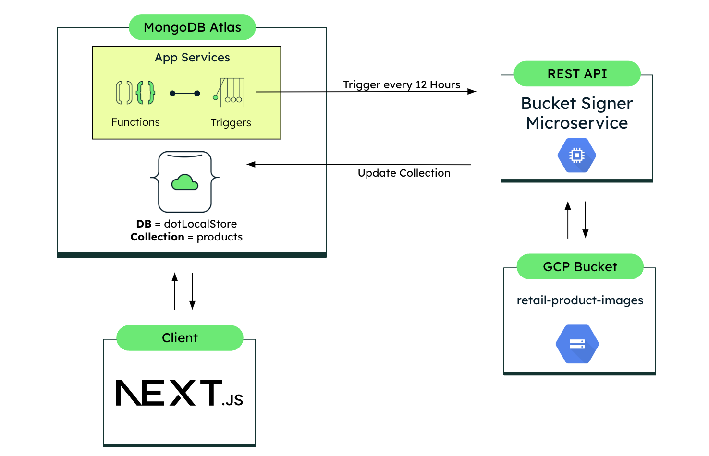

# Bucket Signer Microservice for Google Cloud Platform using MongoDB

The provided microservice is an REST API built using Koa, designed to handle requests for generating signed URLs for files stored in a private Google Cloud Storage (GCS) bucket. Upon receiving a GET request at "/signURLs", it reads the service account key from a JSON file, interacts with the GCS bucket, and then updates the image URLs of corresponding products in a MongoDB collection. The microservice is crucial because the GCS bucket is private; thus, it generates signed URLs that provide temporary access to these files.

## Requirements

- Node.js
- Python
- GCP Service Account Key

## Node.js

### Node.js Compatibility

This project is designed to be compatible with multiple versions of Node.js to ensure broad usability and support. Below are the Node.js versions that have been thoroughly tested and are confirmed to work with this code:

- **v20.10.0** - Stable and recommended for those seeking a balance between the newest features and proven stability.
- **v22.0.0** - Cutting-edge release suitable for those looking to leverage the latest features and improvements in Node.js.

If you do not have Node.js installed, you can download it from the [official website](https://nodejs.org/en).

For those who have Node.js and NVM (Node Version Manager) installed, you can easily switch to the appropriate version using the command:

```bash
nvm use
```

This ensures that you are using the correct version of Node.js as specified in the `.nvmrc` file.

## Python

- **Python 3.11.7**

If you need to install Python, you can download it from the [official website](https://www.python.org/). Installing the correct version ensures compatibility and optimal performance of the code.

## GCP Service Account Key

For this code, you need to create a Service Account for Google Cloud Platform that is able to sign URLs in a bucket.

### Setting Up the GCP Service Account

Create a Service Account: Follow the [official guide](https://cloud.google.com/iam/docs/service-accounts-create#gcloud) to create a service account in your GCP project.

Assign Roles: Ensure the service account has the necessary roles, such as roles/storage.objectViewer and roles/storage.objectAdmin, to access the bucket and sign URLs.

Generate a Key: Create a JSON key for the service account and download it.

### Adding the Service Account Key

There is a `config/` folder in the root directory of the project where you will place your file.

Add the JSON Key: Place the downloaded JSON key file in the config folder and rename it to serviceAccountKey.json.

## Set Up the .env File

To configure your environment variables properly, follow these steps to create a `.env` file in the root directory of this repository:

### Creating the .env File

1.  **Navigate to the Project Root**: Ensure you are in the root directory of your project repository.

2.  **Create the .env File**: You can create the file using a text editor, or by running the following command in your terminal (for Linux and macOS) or Command Prompt (for Windows):
    ```bash
    touch .env
    ```
3.  **Configuring the .env File**: Add the following entries to your .env file. Replace the placeholder values with your specific configurations to ensure the application connects to the appropriate services:
    ```bash
    PORT= # The port on which your server should listen
    MONGODB_URI= # Your MongoDB connection URI
    GCP_STORAGE_BUCKET=# Google Cloud Platform storage bucket name
    DB_NAME= # The name of your database
    ```

> **Important Note:** Keep your .env file secure and never commit it to version control.

## Running It Locally

To launch the server locally on your machine, follow these simple steps:

### Starting the Server

1. **Open your Terminal**: Ensure you are in the root directory of your project.

2. **Install Dependencies**: Before running the server, you need to install all necessary dependencies. Run the following command to do this:

   ```bash
   npm install
   ```

3. **Run the Server**: Execute the following command in your terminal. This will start your Node.js server using the configuration specified in `server.js`:

   ```bash
   npm start
   ```

## Running It with Docker

Using Docker to run your application can simplify setup and ensure consistency across different environments. Follow these steps to build the image and run the container:

### Building and Running the Docker Container

1. **Build the Docker Image**: To create the Docker image for your application, use the `make build` command. This command typically executes the necessary `docker build` operations defined in your `Makefile`:

   ```bash
   make build
   ```

   > **Important Note:** This command will also create and start the container.

2. **Removing the Docker Image and Container**: If you need to clean up or refresh your Docker environment, you can remove the Docker image and container using:

   ```
   make clean
   ```

## The API Architecture

This API is built using Koa and it only has one GET route called `/signURLs`.

Here is an image of the architecture:


